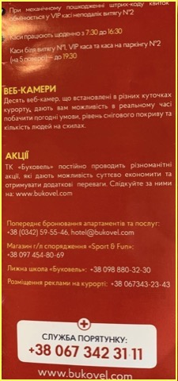
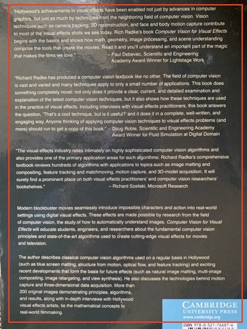

# Tasks for day 1

IMPORTANT! Students are not expected to find unique solution that works in all cases.

Just try to do your best.

Assessment criteria:

FAIR - working solutions customized for every image. >70% solved tasks (17-21 images ).

GOOD - working solutions customized for every image. >90% solved tasks (22-24 images).

EXCELLENT - solution that handles one of image sets with a single set of parameters. 100% solved tasks for other sets.

For separation of text from background correct solution should set text to black and background to white in the following areas:

some amount of noise and small spots are allowed.

You can pass rectangles with text to algorithm, but separation and text/background decision should be done automatically.

For EXCELLENT mark text rectangles should be automatocally detected (you can use open-source software for that or search for rectanges with proper statistics (ratio between background and foreground and ratio of edges) )

For object counting 5% error is allowed.

For object separation from background 5% of missclassification is allowed (5% of total image area can be false positives of false negatives)

## Separate text from background

## Estimate number of objects

## Separate objects from background

