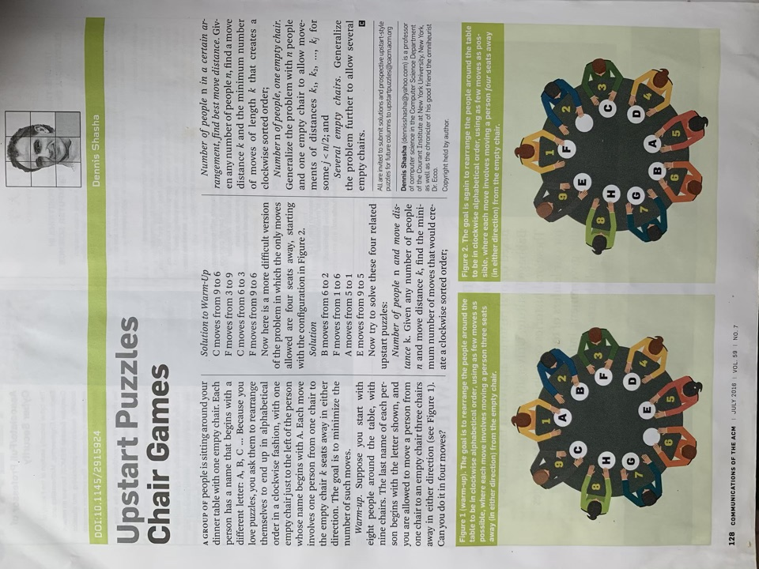
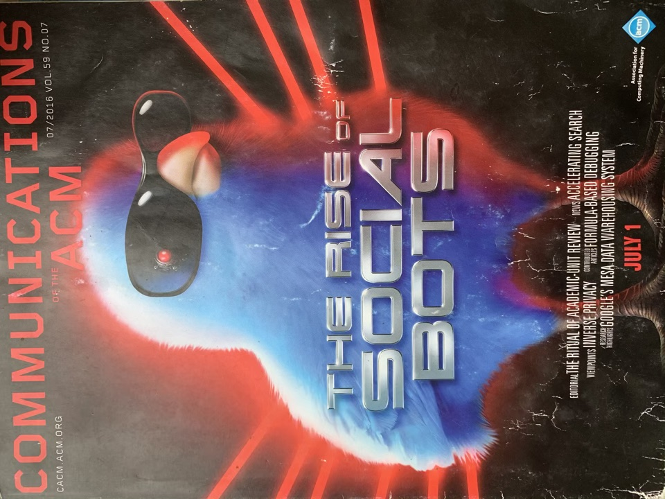
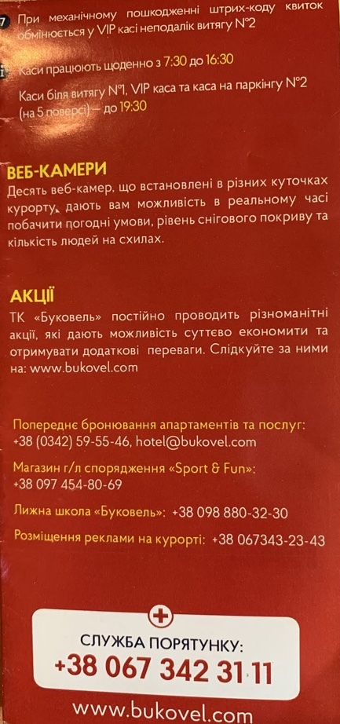
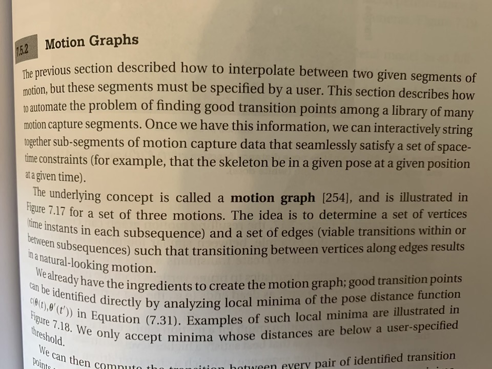
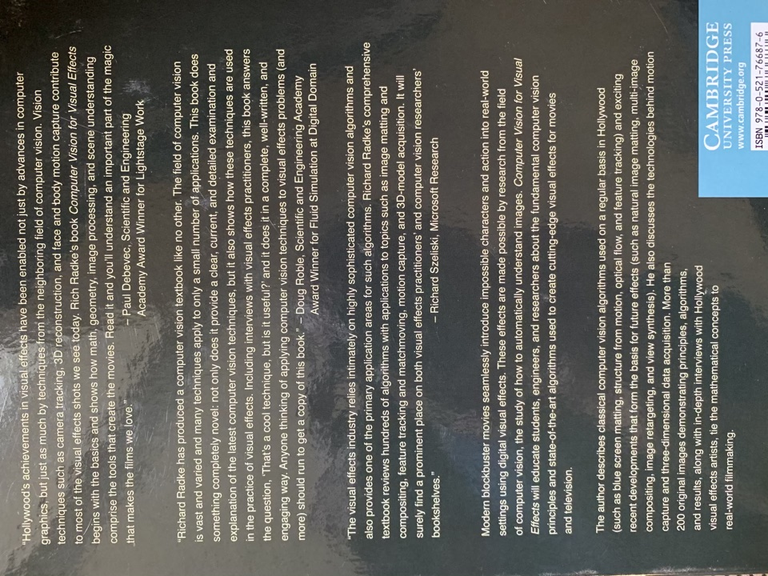
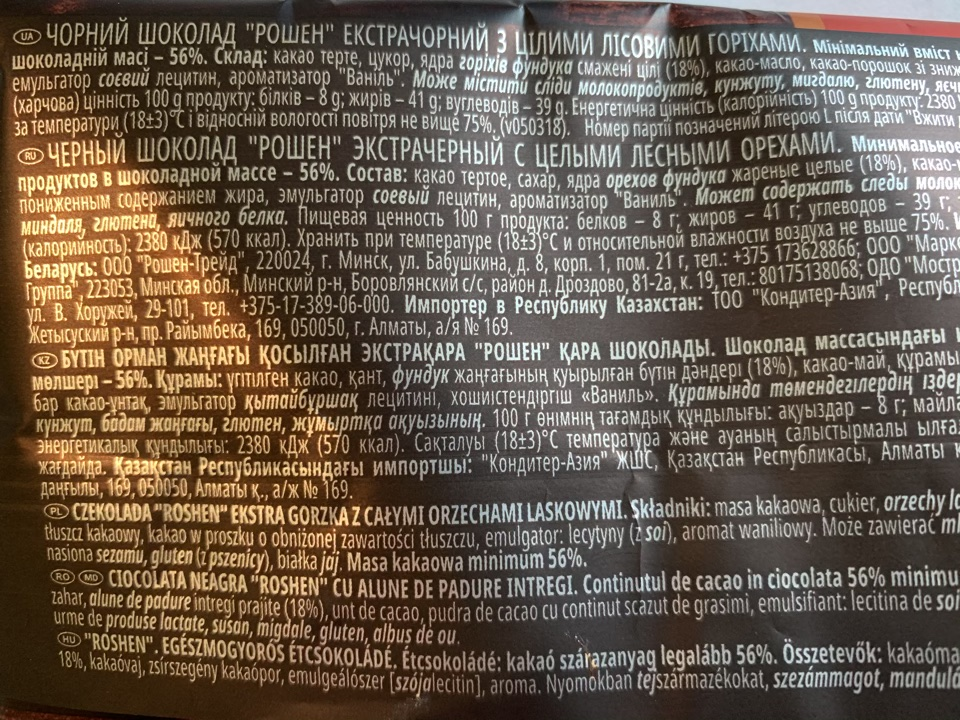
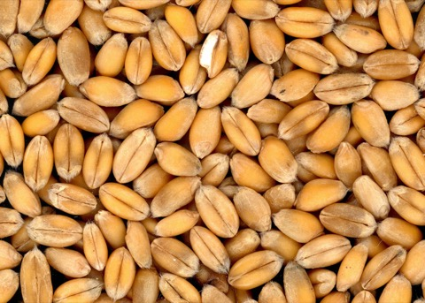
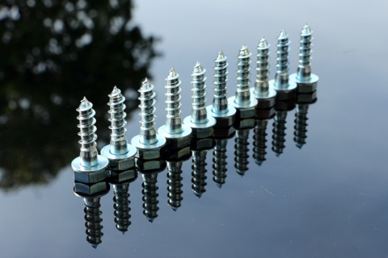
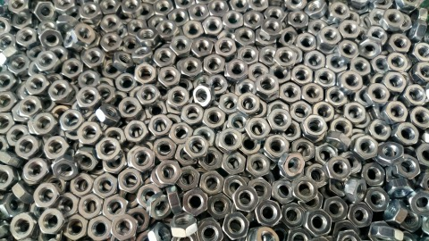

# Tasks for day 1

IMPORTANT! Students are not expected to find unique solution that works in all cases.

Just try to do your best.

Assessment criteria:

FAIR - working solutions customized for every image. >70% solved tasks.

GOOD - working solutions customized for every image. >90% solved tasks.

EXCELLENT - solution that handles image set with single set of parameters

## Separate text from background

## Estimate number of objects

## Separate objects from background

