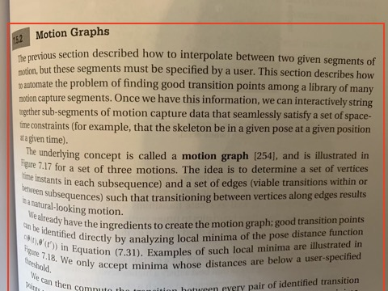
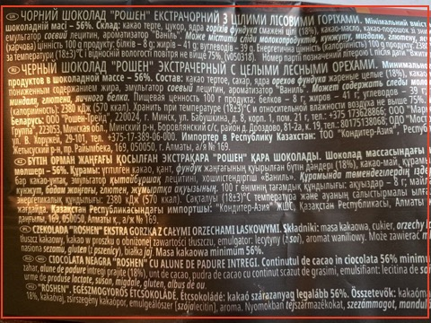

# Tasks for Module 2

1. (15%) Separate text from background [(images for task 1)](#textimages)
2. (15%) Estimate number of objects [(images for task 2)](#countimages)
3. (20%) Separate object from background [(images for task 3)](#objimages)
4. (20%) Find projective transformation matrix with 4 point pairs by solving equation with 13 unknowns (H, w_1, w_2, w_3, w_4)  
5. (30%) Implement (i) or (ii) at your own choice:
   1. Implement Stereo Matching using Dynamic Programming
   2. Implement PatchMatch algorithm

You should not use ready-made implementations or take working code from github or other sources

You can downscale images for faster processing.

Test images for stereo matching can be taken from
https://vision.middlebury.edu/stereo/data/scenes2014/zip/

For example:

https://vision.middlebury.edu/stereo/data/scenes2014/zip/Flowers-perfect.zip
https://vision.middlebury.edu/stereo/data/scenes2014/zip/Couch-perfect.zip

Test images for testing the Patch Match algorithm can be taken from

https://github.com/mdavydov/ComputerVisionCourse/tree/master/frames

for example

https://raw.githubusercontent.com/mdavydov/ComputerVisionCourse/master/frames/v001.jpg
https://raw.githubusercontent.com/mdavydov/ComputerVisionCourse/master/frames/v020.jpg
https://raw.githubusercontent.com/mdavydov/ComputerVisionCourse/master/frames/v030.jpg

**Solutions should be available on colab.research.google.com and shared for access using link only**

## Notes

**In task 5** correctness of solution (up to scalar multiplier) can be verified using cv functions:

```
cv2.getPerspectiveTransform(pts1,pts2)
cv2.warpPerspective(img,M,(w, h))
```

## Assessment criteria

### Assessment criteria for day 1 tasks (1-3):

IMPORTANT! You are not expected to implement one algorithm that works in all provided cases. Just try to do your best.

For separation of text from background correct solution should set text to black and background to white in the following areas:





some amount of noise and small spots are allowed.

You can pass rectangles with text to algorithm, but separation and text/background decision should be done automatically.

For EXCELLENT mark text rectangles should be automatically detected (you can use open-source software for that or search for rectanges with proper statistics (ratio between background and foreground and ratio of edges) )

## <a name="textimages"></a> Separate text from background


## <a name="countimages"></a> Estimate number of objects


## <a name="objimages"></a> Separate objects from background


