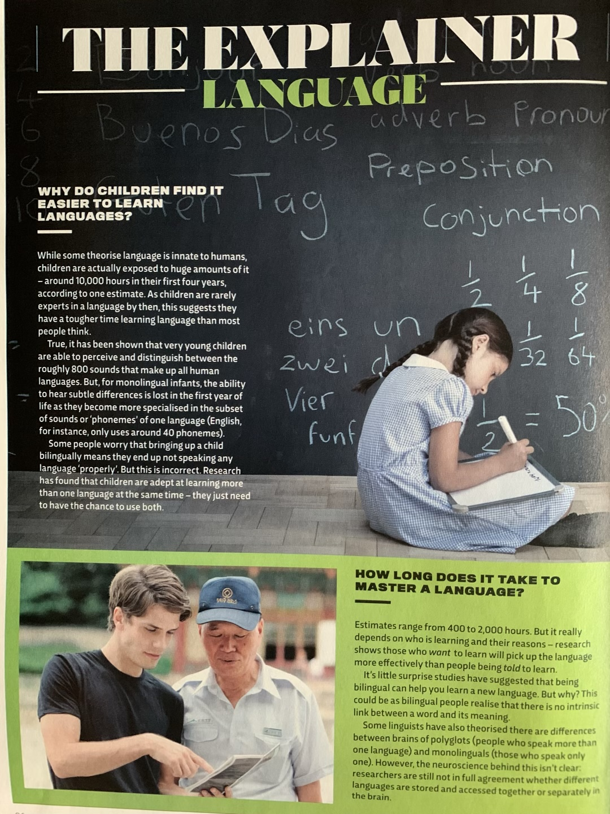

# Tasks for Module 2

1. (15 points) Separate text from background and denoise [(images for task 1)](#textimages).

   The segmentation should make all background white and all text black.
   The algorithm should detect areas with inverted text automatically
3. (15 points) Estimate number of objects [(images for task 2)](#countimages)
   
   You can manually adjust segmentation parameters for each image or have one algorithm and get +5 points

5. (20 points) Separate object from background [(images for task 3)](#objimages)

   Adjust parameters of GrabCut algorithm to get the best result and compare to the result of u2Net-p neural network

7. (20 points) Find projective transformation matrix with 4 point pairs by solving equation with 13 unknowns (H, w_1, w_2, w_3, w_4)  
8. (30 points) Implement (i) or (ii) at your own choice:
   1. Implement Stereo Matching using Dynamic Programming
   2. Implement PatchMatch algorithm

   In both tasks you should visualize obtained optical flow.
   You should not use ready-made implementations or take working code from github or other sources.
   You can downscale images for faster processing.

Test images for stereo matching can be taken from
https://vision.middlebury.edu/stereo/data/scenes2014/zip/


For example:

https://vision.middlebury.edu/stereo/data/scenes2014/zip/Flowers-perfect.zip

https://vision.middlebury.edu/stereo/data/scenes2014/zip/Couch-perfect.zip

Test images for testing the Patch Match algorithm can be taken from MPI Sintel dataset (http://sintel.is.tue.mpg.de/downloads)

for example


**Solutions should be available on colab.research.google.com and shared for access using link only**

## Notes

**In task 4** correctness of solution (up to scalar multiplier) can be verified using cv functions:

```
cv2.getPerspectiveTransform(pts1,pts2)
cv2.warpPerspective(img,M,(w, h))
```

## <a name="textimages"></a> Separate text from background





## <a name="countimages"></a> Estimate number of objects


## <a name="objimages"></a> Separate objects from background


