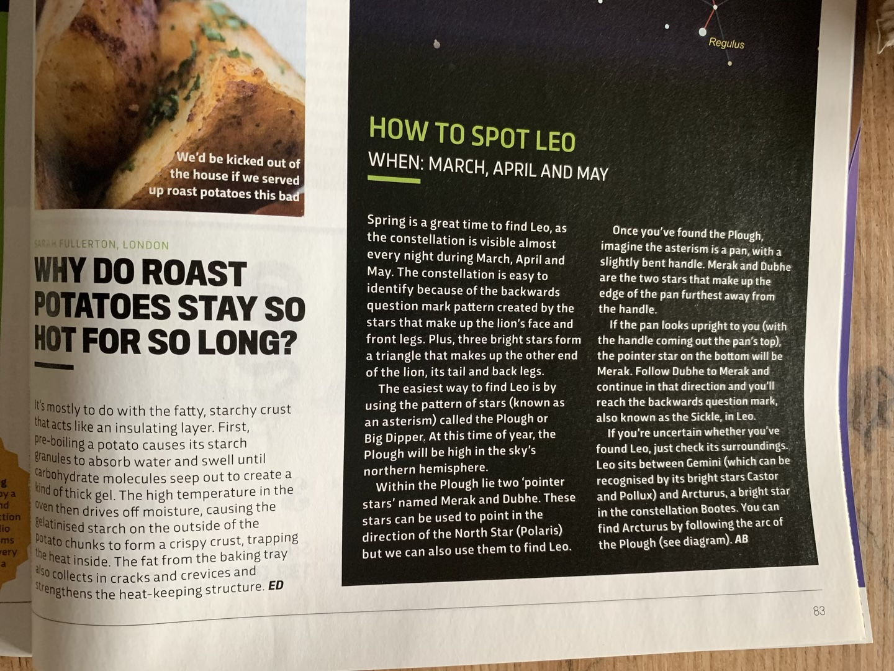
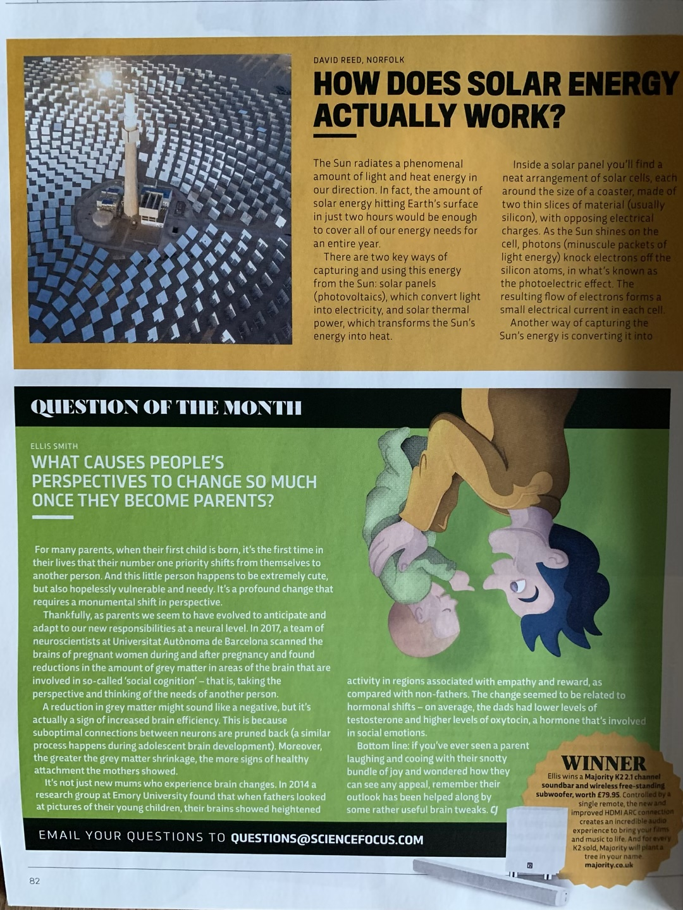
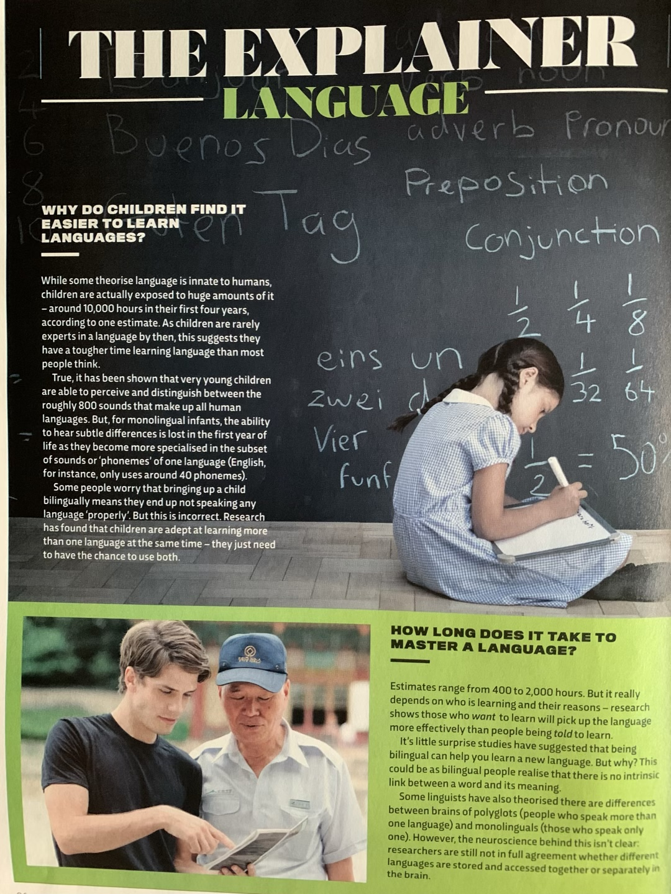
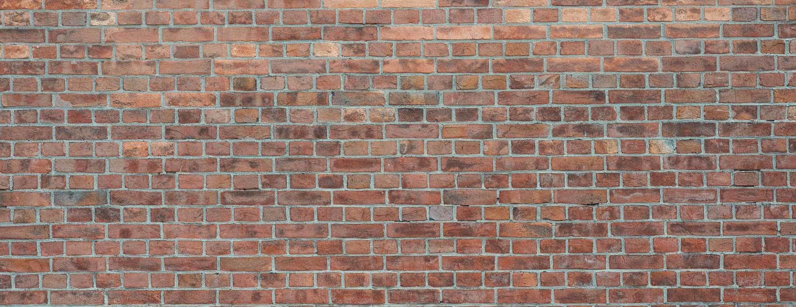
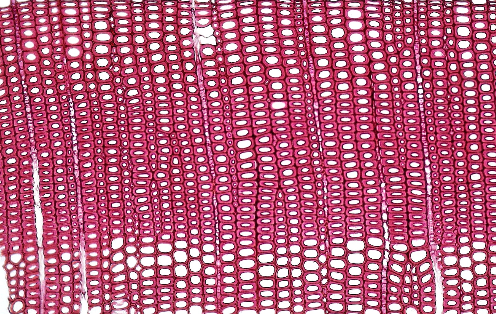
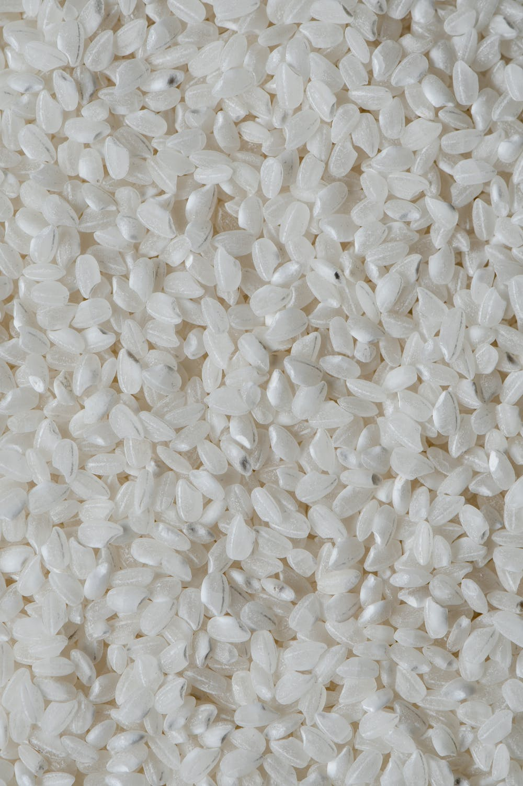
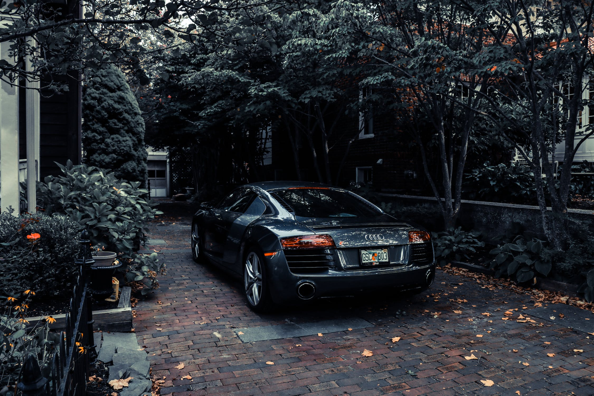
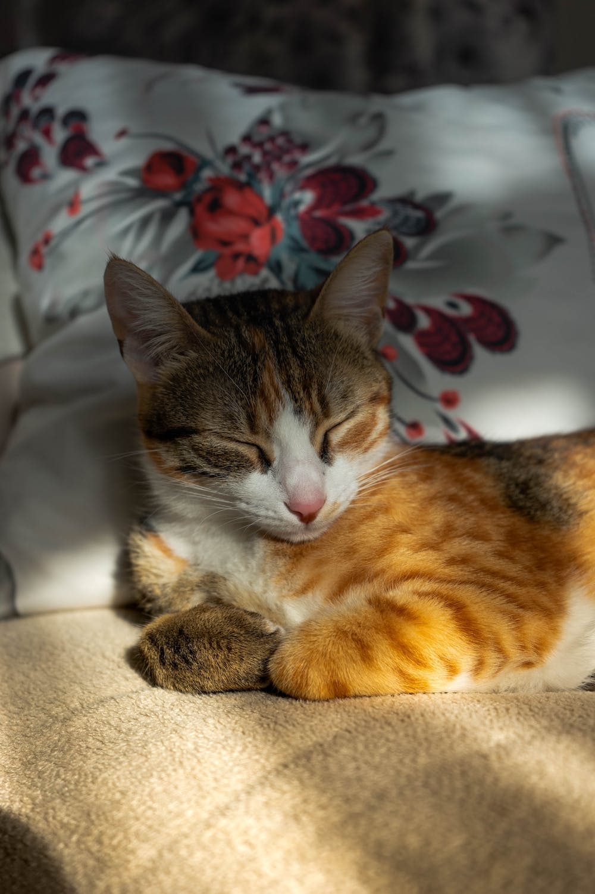
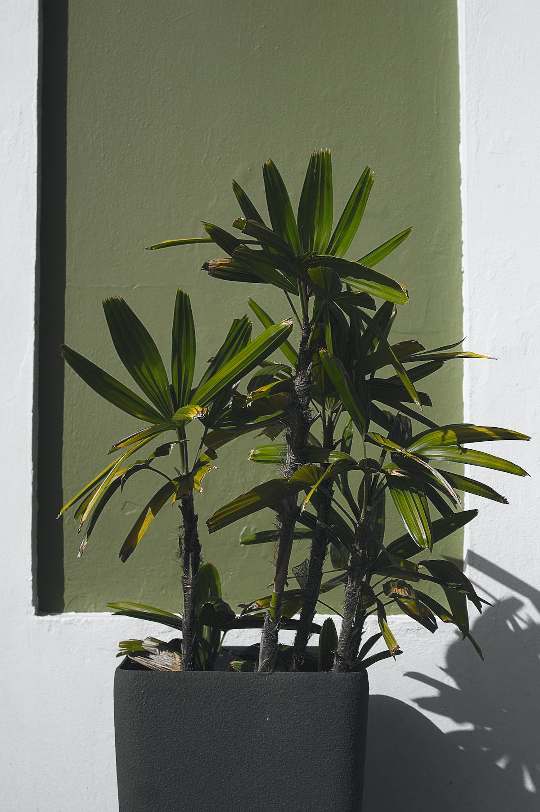

# Task for Module 2 (2023)

1. (10 points) Separate text from background and denoise [(images for task 1)](#textimages).

   The segmentation should make all background white and all text black.
   The algorithm should detect areas with inverted text automatically.
   The algorithm should handle all 3 images without special adjustment for every image.
   
2. (15 points) Estimate number of objects [(images for task 2)](#countimages)
   
   You can manually adjust segmentation parameters for each image or have one algorithm and get +5 points

3. (15 points) Separate object from background [(images for task 3)](#objimages)

   Adjust parameters of GrabCut algorithm to get the best result and compare to the result of u2Net-p neural network

4. (60 points) Research of ORB and SIFT feature matching. More info in colab https://colab.research.google.com/drive/1kgS_ULLbmkDD6qNJwOyeR4J7ezy19eWa?usp=sharing

**Solutions should be available on colab.research.google.com and shared for public access using link only**

## Notes

**In task 4** correctness of solution (up to scalar multiplier) can be verified using cv functions:

```
cv2.getPerspectiveTransform(pts1,pts2)
cv2.warpPerspective(img,M,(w, h))
```

## <a name="textimages"></a> Separate text from background








## <a name="countimages"></a> Estimate number of objects







## <a name="objimages"></a> Separate objects from background








